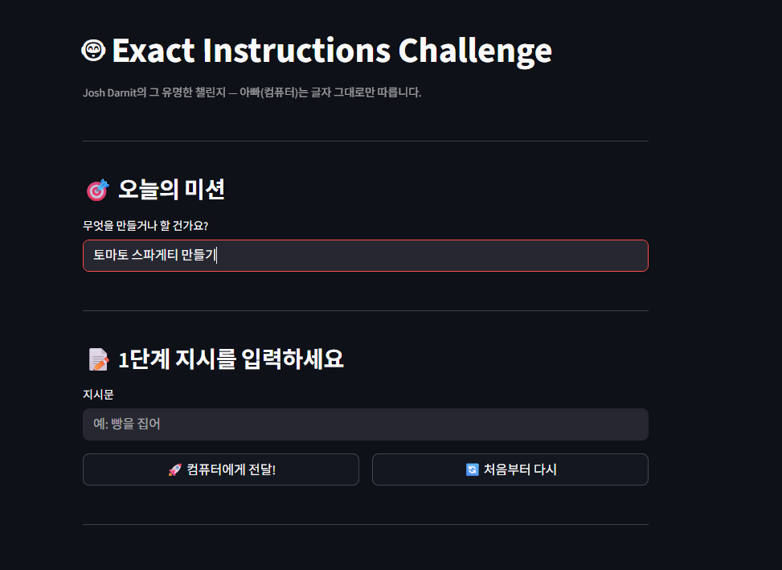

# 🤖 Exact Instructions Challenge

> **Josh Darnit**의 유명한 "Exact Instructions Challenge" 콘셉트를 웹 서비스로 구현한 프로젝트  
> 사용자가 단계별 지시문을 입력하면, AI가 **컴퓨터처럼 글자 그대로만** 해석해서 황당한 반응을 돌려줍니다.

---

## 🎯 프로젝트 소개

Josh Darnit의 원본 영상에서 아이들이 "빵을 집어"라고 말하면 아빠가 *어느 빵인지, 어느 손으로 집을지 명시되지 않았다*며 실행을 거부하는 것처럼, 이 서비스도 동일하게 동작합니다.

**컴퓨터(AI)는 항상 옳습니다. 명령이 불명확할 뿐입니다.** 😈

---

## 🖼️ 데모

### 메인 화면 — 미션 설정 & 지시문 입력



### 실제 동작 — "냉장고에 가서 토마토 스파게티 재료를 가져와"


> 🤖 컴퓨터: **"냉장고에 가서" — 내가 어디에 있는지, 냉장고가 어디에 있는지 명시되지 않음.**  
> "토마토 스파게티 재료" — 구체적으로 어떤 재료인지 나열되지 않음 (토마토? 파스타? 올리브유?).  
> 명령을 실행할 수 없습니다.

---

## 🛠️ 기술 스택

| 구분            | 기술                                    |
| --------------- | --------------------------------------- |
| **Backend**     | FastAPI, Uvicorn                        |
| **Frontend**    | Streamlit                               |
| **AI**          | Anthropic Claude API (claude-haiku-4-5) |
| **데이터 검증** | Pydantic                                |
| **환경 변수**   | python-dotenv                           |
| **언어**        | Python 3.11                             |

---

## 📁 프로젝트 구조

```
exact-instructions-challenge/
├── backend/
│   ├── main.py            # FastAPI 앱 진입점
│   ├── interpreter.py     # Claude API 호출 & literal 해석 로직
│   └── schemas.py         # Pydantic 요청/응답 모델
├── frontend/
│   └── app.py             # Streamlit 채팅 UI
├── .env                   # API 키 (git 제외)
├── .gitignore
├── requirements.txt
└── README.md
```

---

## ⚙️ 설치 및 실행

### 1. 레포지토리 클론

```bash
git clone https://github.com/bird8696/exact-instructions-challenge.git
cd exact-instructions-challenge
```

### 2. 가상환경 생성 & 활성화

```bash
python -m venv venv

# Windows (Git Bash)
source venv/Scripts/activate

# macOS / Linux
source venv/bin/activate
```

### 3. 패키지 설치

```bash
pip install -r requirements.txt
```

### 4. 환경 변수 설정

루트 디렉토리에 `.env` 파일 생성:

```
ANTHROPIC_API_KEY=sk-ant-여기에_API_키_입력
```

### 5. 서버 실행 (터미널 2개)

**터미널 1 — 백엔드:**

```bash
cd backend
uvicorn main:app --reload --port 8000
```

**터미널 2 — 프론트엔드:**

```bash
cd frontend
streamlit run app.py
```

브라우저에서 `http://localhost:8501` 접속 🚀

---

## 🔌 API 명세

### `POST /interpret`

지시문을 받아 literal 해석 결과를 반환합니다.

**Request:**

```json
{
  "instruction": "냉장고에 가서 재료를 가져와",
  "step_number": 1
}
```

**Response:**

```json
{
  "step_number": 1,
  "original": "냉장고에 가서 재료를 가져와",
  "literal_response": "ERROR: '냉장고에 가서'의 위치 좌표가 명시되지 않았습니다. 명령을 실행할 수 없습니다."
}
```

### `DELETE /reset`

게임 초기화

---

## 🎮 사용 방법

1. **오늘의 미션** 입력 (예: `토마토 스파게티 만들기`)
2. **단계별 지시문** 입력 (예: `냉장고에 가서 재료를 가져와`)
3. 🚀 **컴퓨터에게 전달!** 버튼 클릭
4. AI의 황당한 literal 해석 감상 😂
5. 지시를 더 정확하게 수정해서 다시 도전!

---

## 💡 학습 포인트

이 프로젝트를 통해 배울 수 있는 것들:

- 컴퓨터는 **명확한 명령어**가 필요하다는 것
- 사람은 자연스럽게 **문맥을 추론**하지만 컴퓨터는 그렇지 않음
- **프로그래밍**이란 결국 컴퓨터가 오해 없이 이해할 수 있도록 지시를 작성하는 것

> 💬 _"Step 1: Get two pieces of bread out."_  
> 🤖 _"Which bread? How many? From where?"_  
> — Josh Darnit, Exact Instructions Challenge

---

## 📦 주요 패키지 버전

```
fastapi
uvicorn
streamlit
anthropic
python-dotenv
requests
pydantic
```

> `pip freeze > requirements.txt` 로 전체 버전 확인 가능

---

## 👤 개발자

**Kim Taehyun (bird8696)**  
🔗 [GitHub](https://github.com/bird8696)

---

## 📝 참고

- 원본 영상: [Josh Darnit - Exact Instructions Challenge](https://www.youtube.com/watch?v=cDA3_5982h8)
- 강의 과정: SK Shieldus Rookies — 생성형AI 활용 (FastAPI + Claude API)
